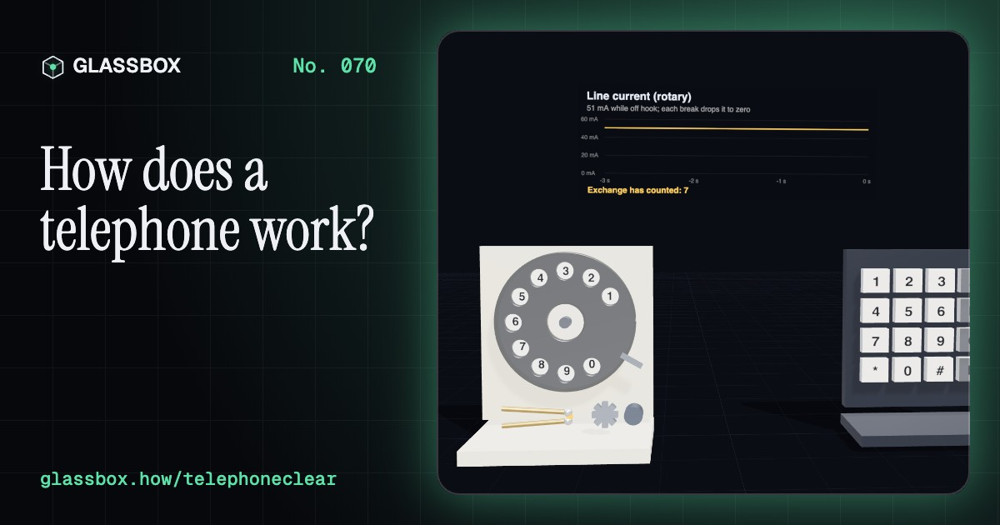
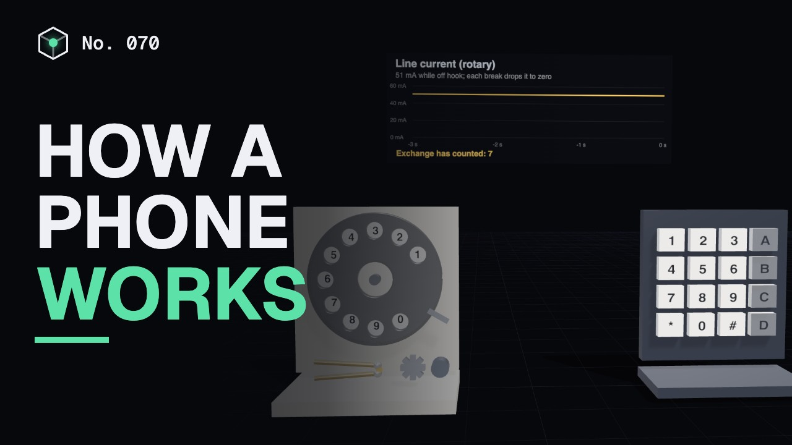
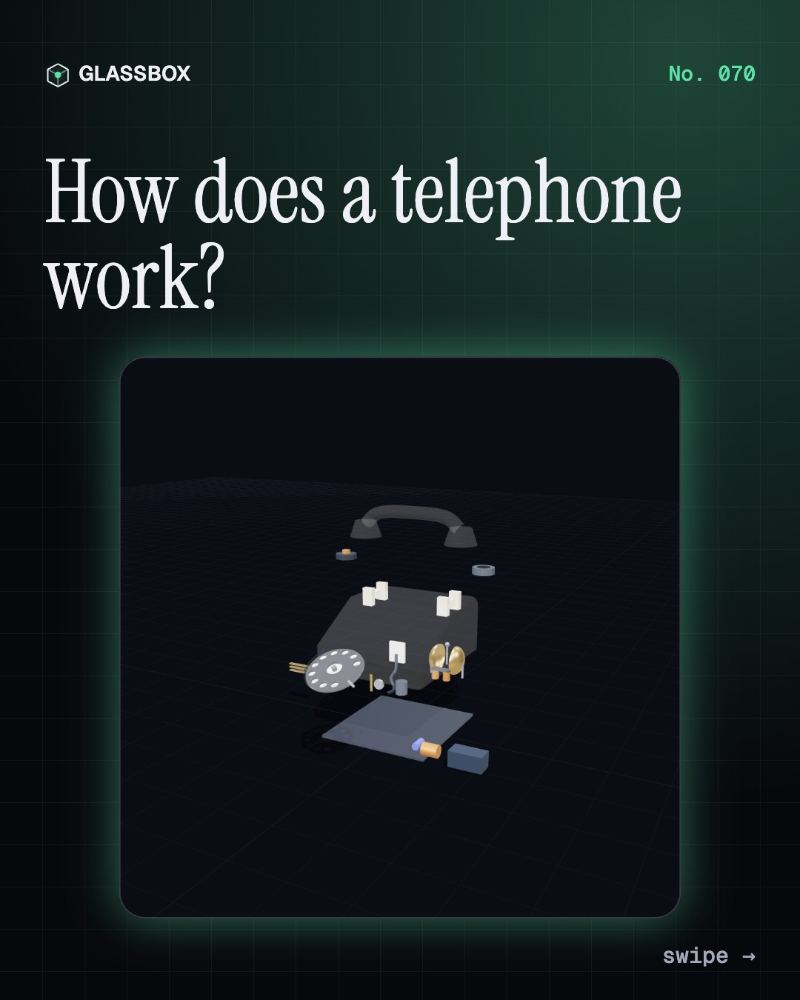
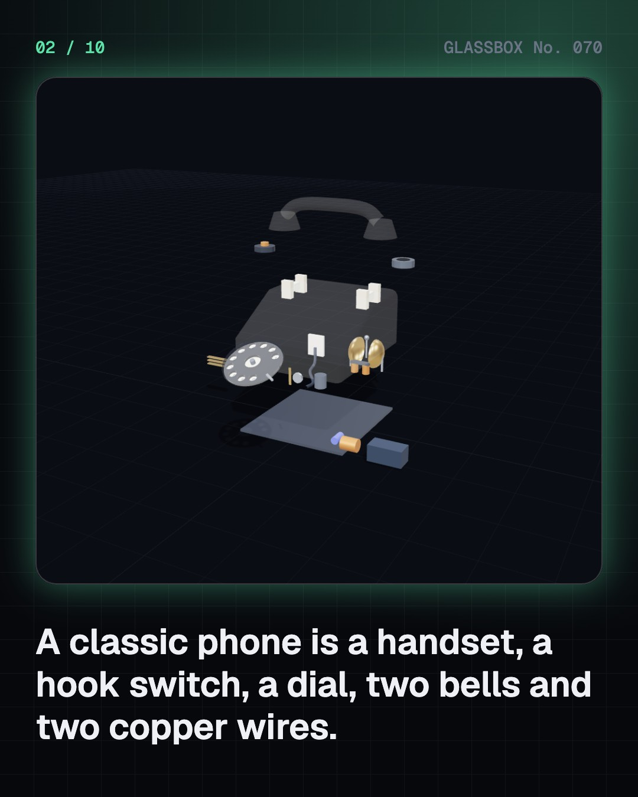
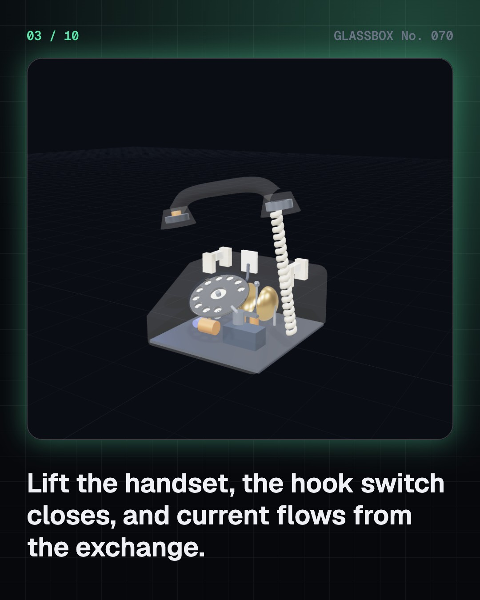
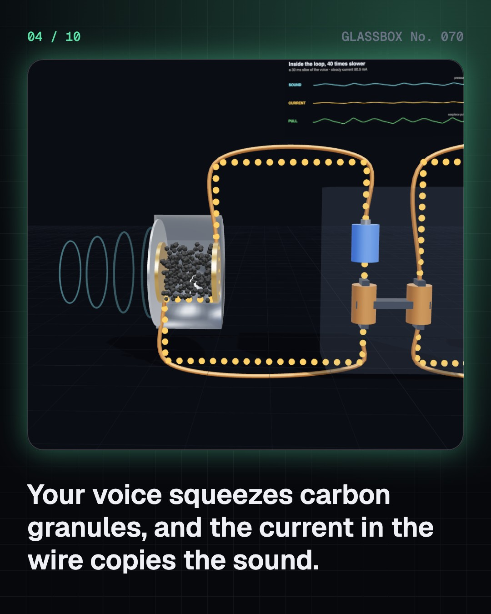

<!-- glassbox:start -->
<!-- Generated from glassbox.json by the Glassbox hub (npm run readme -- telephoneclear). Edit glassbox.json, not this block. -->
<p align="center"><a href="https://glassbox-production-fd52.up.railway.app/e/telephoneclear/"></a></p>

<h1 align="center">TelephoneClear</h1>

<p align="center"><b>How does a telephone work?</b><br>Your voice squeezes a pinch of carbon, a current copies the sound, and a switch that steps once per pulse finds the other phone. Take a rotary phone apart in 3D, dial it, ring it, and hear why calls sound so "telephone-y".</p>

<p align="center"><a href="https://glassbox-production-fd52.up.railway.app/telephoneclear/"><b>▶ Play with it</b></a> &nbsp;·&nbsp; <a href="https://glassbox-production-fd52.up.railway.app/e/telephoneclear/">Read the 60-second explainer</a> &nbsp;·&nbsp; <a href="https://glassbox-production-fd52.up.railway.app/telephoneclear/glassbox/reel.mp4">Watch the 40-second video</a></p>

<p align="center">
  <a href="https://glassbox-production-fd52.up.railway.app/e/telephoneclear/"></a>
  <a href="https://glassbox-production-fd52.up.railway.app/e/telephoneclear/"></a>
  <a href="LICENSE"></a>
  <a href="LICENSE-CONTENT.md"></a>
  <a href="#privacy"></a>
</p>

## In 60 seconds

1. **Two wires and a battery.** A classic phone hangs on a pair of copper wires that run to the exchange. The exchange puts about 48 volts on them. Lift the handset, the hook switch closes, and 20 to 60 milliamps flow round the loop. That current tells the exchange you want to call, and it powers the phone, even in a power cut.
2. **A voice becomes a current.** In the mouthpiece, sound squeezes carbon granules behind a diaphragm. Squeezed, they conduct better, so the current rises and falls in the same pattern as your voice. At the far end, that current drives an electromagnet on a permanent magnet, which pulls a steel diaphragm and makes the sound again.
3. **Dialling is counting.** A rotary dial breaks the current once per step as it spins back, 10 times a second: 7 breaks for a 7, 10 for a 0. Touch-tone keys send two notes at once instead, one for the row and one for the column, from 697 to 1,633 Hz.
4. **The exchange joins the wires.** First operators plugged cords into jacks. From 1892, Strowger switches stepped up one level and round one contact per pulse, with no operator at all. Crossbar grids and then digital chips took over. The exchange rings the other phone with about 75 volts at 25 hertz.
5. **Many calls share one line.** Long-distance trunks carry voices as numbers: 8,000 samples a second, 8 bits each, 64 kbit/s per call. Calls take turns in time slots, 30 to an E1 line and millions to a fibre. A satellite hop adds about a quarter of a second of delay, which is why undersea fibre won.
6. **Why calls sound telephone-y.** A classic phone channel carries only 300 to 3,400 Hz, enough for words but not for the deep boom or the hiss of a voice. Today many landlines are VoIP over fibre, HD voice widens the band, and 112 reaches emergency help across India and Europe.

## Words worth knowing

| Term | Meaning |
|---|---|
| **Local loop** | The pair of copper wires between your phone and the exchange. |
| **Hook switch** | The switch under the cradle that connects the phone to the line when you lift the handset. |
| **Carbon transmitter** | A microphone whose carbon granules change their resistance when sound squeezes them. |
| **Pulse dialling** | Sending a digit by breaking the line current that many times, about 10 times a second. |
| **DTMF** | Dual-tone multi-frequency: each key sends one low and one high tone at the same time. |
| **Strowger switch** | An electromechanical switch that steps up and round, one step per dial pulse. |
| **Ringing current** | An alternating voltage of about 75 V at 25 Hz that the exchange sends to ring a phone. |
| **Time-division multiplexing** | Many calls taking turns on one line, a few bits each, thousands of times a second. |
| **Voice band** | The 300 to 3,400 Hz range a classic phone line carries. |

## A short history

**From a voice on a string to calls as packets of light: 150 years of talking at a distance.**

- **1876** · Bell patents the telephone (Alexander Graham Bell, Boston)
- **1877** · Carbon makes the voice loud (Thomas Edison, David Edward Hughes, Menlo Park, USA; London, England)
- **1878** · The first telephone exchange (George W. Coy, New Haven, Connecticut)
- **1882** · India's first telephone exchanges (Oriental Telephone Company, Calcutta (Kolkata), Bombay (Mumbai) and Madras (Chennai))
- **1891** · A switch with no operator (Almon Strowger, Kansas City, Missouri)
- **1956** · TAT-1: the first transatlantic telephone cable (British Post Office, AT&T and Canada, Oban, Scotland to Clarenville, Newfoundland)
- **1963** · Touch-tone (Bell System, Carnegie and Greensburg, Pennsylvania)
- **1984** · C-DOT: India builds its own exchanges (Sam Pitroda and the Government of India, New Delhi)

The full story, with 28 moments, charts, people and 30 sources: [glassbox.how/e/telephoneclear/history](https://glassbox-production-fd52.up.railway.app/e/telephoneclear/history/). The data lives in [`history.json`](history.json).

## Video and slides

Made with the Glassbox studio from this box's storyboard (`window.glassbox.director`). Free to reuse under CC BY 4.0.

<a href="https://glassbox-production-fd52.up.railway.app/telephoneclear/glassbox/video.mp4"></a>

<p><a href="glassbox/slide-1.jpg"></a> <a href="glassbox/slide-2.jpg"></a> <a href="glassbox/slide-3.jpg"></a> <a href="glassbox/slide-4.jpg"></a></p>

| File | What | Size |
|---|---|---|
| [`glassbox/reel.mp4`](https://glassbox-production-fd52.up.railway.app/telephoneclear/glassbox/reel.mp4) | Reel / Short, with captions and soundtrack | 1080×1920 |
| [`glassbox/video.mp4`](https://glassbox-production-fd52.up.railway.app/telephoneclear/glassbox/video.mp4) | YouTube video, with captions and soundtrack | 1920×1080 |
| `glassbox/slide-1…10.jpg` | Instagram carousel | 1080×1350 |
| `glassbox/thumb.jpg` | YouTube thumbnail | 1280×720 |
| `glassbox/cover.jpg` | Share card and repo social preview | 1200×630 |
| [`glassbox/history-reel.mp4`](https://glassbox-production-fd52.up.railway.app/telephoneclear/glassbox/history-reel.mp4) | “History in 10 moments” Reel / Short | 1080×1920 |
| `glassbox/history-slide-*.jpg` | History carousel | 1080×1350 |
| `glassbox/post.json` | Post copy and schedule used by the publish kit | |

## Privacy

This box has no accounts and no ads, and it ships its own fonts and libraries. When you run it yourself it sends nothing anywhere. On glassbox.how, the site's `/bar.js` also loads Glassbox's analytics: **Google Analytics** to count visits (it asks first in the EU, UK and Switzerland, and stays off when your browser sends Global Privacy Control or Do Not Track) and **ClickTrust** to detect bots.

It remembers a few things **in your own browser only**, and never sends them anywhere:

| Browser storage key | What it holds |
|---|---|
| `telephoneclear.v1` | Which chapters you have opened, your best quiz scores, and sound on or off. |

Exactly what each one sees is at [glassbox.how/privacy](https://glassbox-production-fd52.up.railway.app/privacy/).

## Licences

- **Code:** [MIT](LICENSE). Use it, change it, ship it.
- **Explanations, text, images and videos** (`glassbox.json`, `glassbox/`): [CC BY 4.0](LICENSE-CONTENT.md). Credit “Glassbox, glassbox.how/e/telephoneclear”.
- **Third-party parts** keep their own licences: [three.js](https://threejs.org) (MIT), [Geist, Instrument Serif](https://openfontlicense.org) (SIL OFL 1.1).
- The Glassbox name and logo aren't covered by either licence. See the [terms](https://glassbox-production-fd52.up.railway.app/terms/).

Found a mistake? [Open an issue](https://github.com/bdeeps/telephoneclear/issues). Corrections happen in public.
<!-- glassbox:end -->

## Run it

It's plain HTML, CSS and JavaScript. No build step and no dependencies. Run locally, it contacts no other website.

```bash
python3 -m http.server 8000
```

Three.js and the fonts ship in `vendor/` and `fonts/`, so it also works offline.

Then open http://localhost:8000.

## How it's built

| File | What |
|---|---|
| `index.html`, `css/app.css` | The page and its styles |
| `js/app.js`, `js/stage.js`, `js/ui.js`, `js/kit.js` | The shared Glassbox 3D engine: chapters, 3D stage, controls, quiz, video director |
| `js/chapters/*.js` | One file per chapter: the 3D model, controls, text, key terms, quiz and video scenes |
| `js/phone.js` | Shared parts: line physics (48 V loop, ringing, pulses, DTMF), a synthetic voice and sound lab with a mute-aware Web Audio player, canvas boards, and the rotary desk phone model |
| `glassbox.json` | Title, question, explainer beats, key terms, browser storage and credits shown on glassbox.how |
| `reel` in each chapter | The storyboard the Glassbox studio records into short videos |
| `glassbox/` | The published video, slides, thumbnail and post copy |
| `fonts/`, `vendor/three/` | Self-hosted Geist and Instrument Serif (SIL OFL 1.1) and three.js (MIT) |
